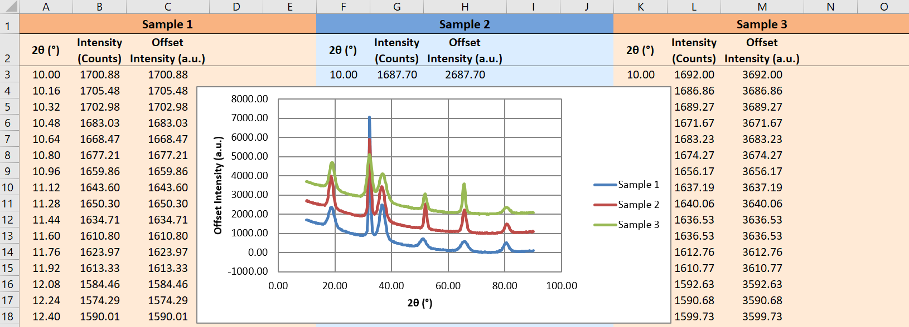
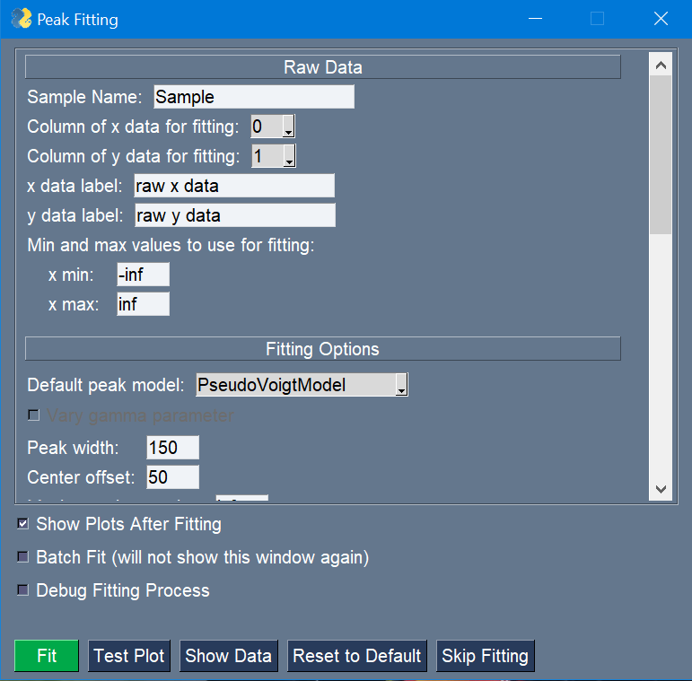
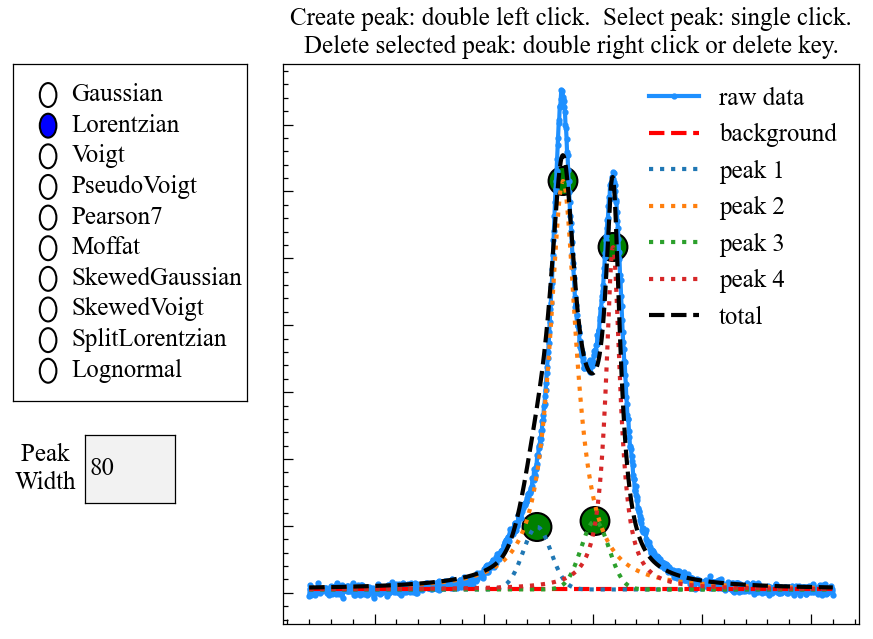
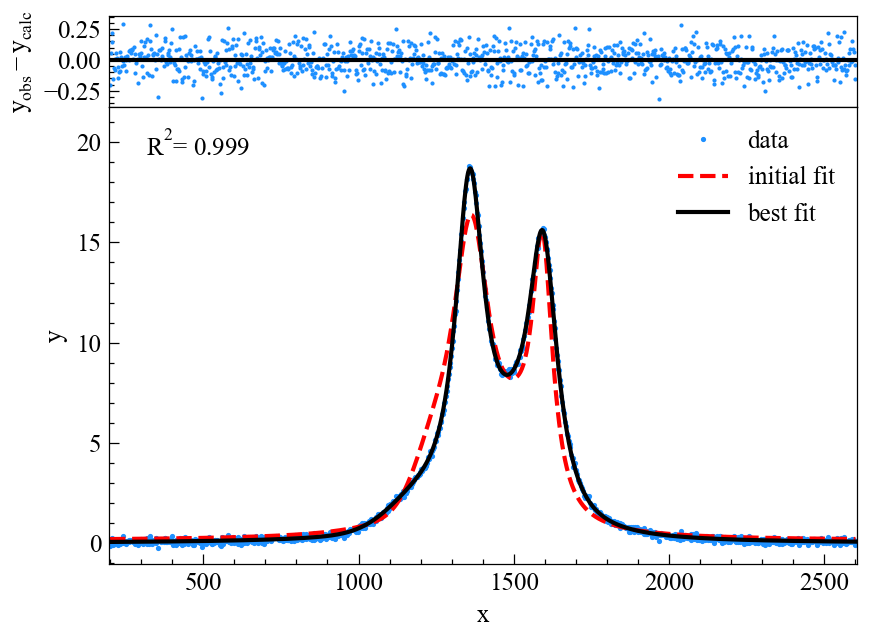
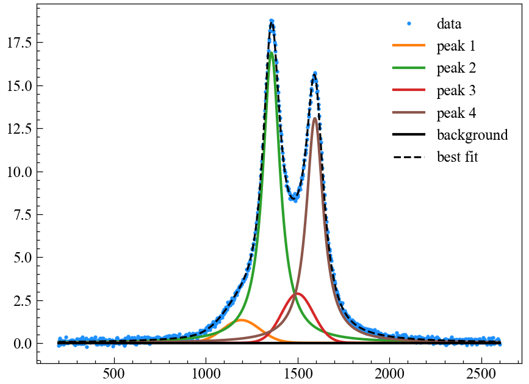

===========
Description
===========

Purpose
~~~~~~~

The aim of mcetl is to ease the repeated processing of data files. Contrary to its name, mcetl
can process any tabulated files (txt, csv, tsv, etc.), and does not require that the files originate
from materials characterization (abbreviated as MC). However, the focus on MC was selected because:

* Most data files from MC are relatively small in size (a few kB or MB).
* MC files are typically cleanly tabulated and do not require handling messy or missing data.
* Shamelessly improving my SEO :)

mcetl requires only a very basic understanding of python to use, and allows a single person to
create a tool that their entire group can use to process data and produce Excel files with a 
consistent style. mcetl can create new Excel files when processing data or saving peak fitting
results, or it can append to an existing Excel file to easily work with already created files.

Screenshots
~~~~~~~~~~~

Main GUI
^^^^^^^^

.. figure:: images/main_menu_1.png
   :align: center
   :scale: 40 %

   The main menu.

.. figure:: images/main_menu_2.png
   :align: center
   :scale: 40 %

   Selection of the DataSource object to use.

   The output Excel file after processing all the raw data files.

Peak Fitting
^^^^^^^^^^^^

   The peak fitting GUI.

   Manual selection of peaks is enabled using matplotlib.

   The initial fit and best fit after peak fitting.

   Individual peaks from the best fit.

Plotting
^^^^^^^^

.. figure:: images/plotting_gui.png
   :align: center
   :scale: 40 %

   The plotting GUI.

Limitations
~~~~~~~~~~~

* Since mcetl uses the pandas library to load files into memory for processing, it is not suited 
  for processing files whose total memory size is large (> ~10% of total RAM). mcetl attempts to reduce
  the required memory by downcasting types to their smallest representation (eg. converting float64 to float32),
  but this can only do so much.

* mcetl does not provide any built-in resources for cleaning data, although the user can easily 
  manually implement this into the processing pipeline for a DataSource.

* mcetl does not provide any resources for processing data files directly from characterization equipment (such as
  .XRDML, .PAR, etc.). Other libraries such as xylib already exist and are capable of converting many such files
  to a format mcetl can use (txt, csv, etc.).

* The peak fitting and plotting modules in mcetl are not as feature-complete as other alternatives such as
  Origin, fityk, SciDAVis, etc. The modules are included in mcetl in case those better alternatives are not
  available, and the author highly recommends using those alternatives over mcetl if available.
