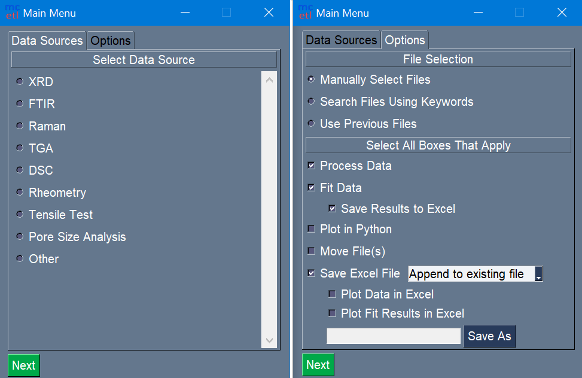
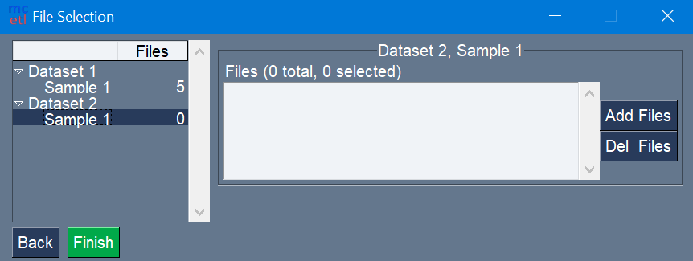
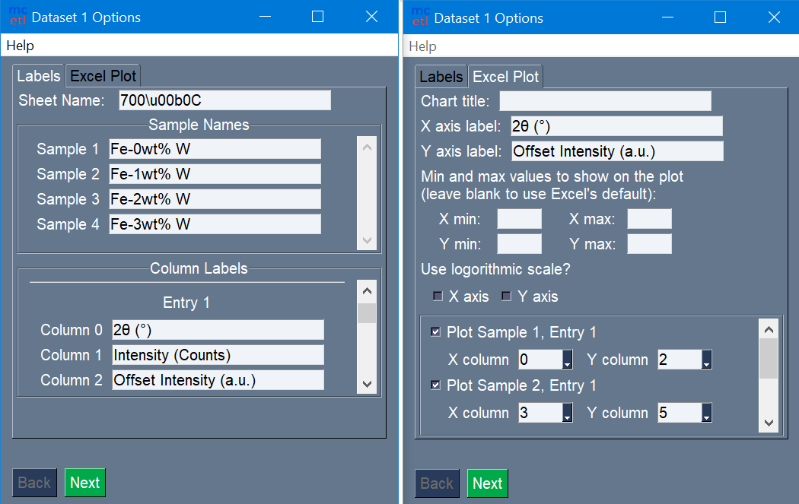
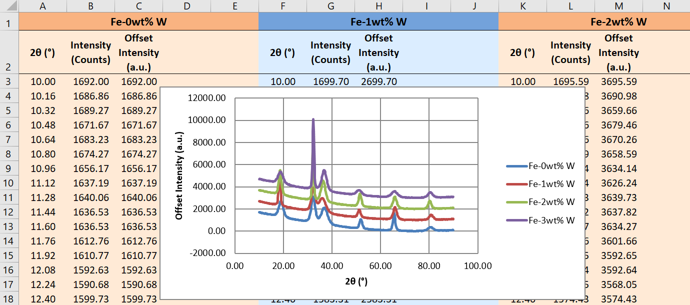
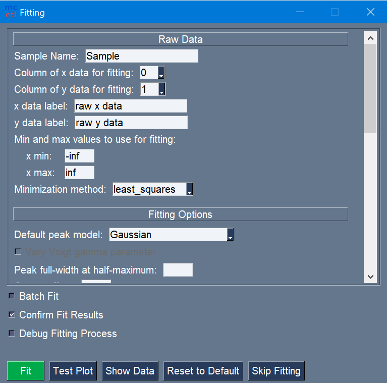
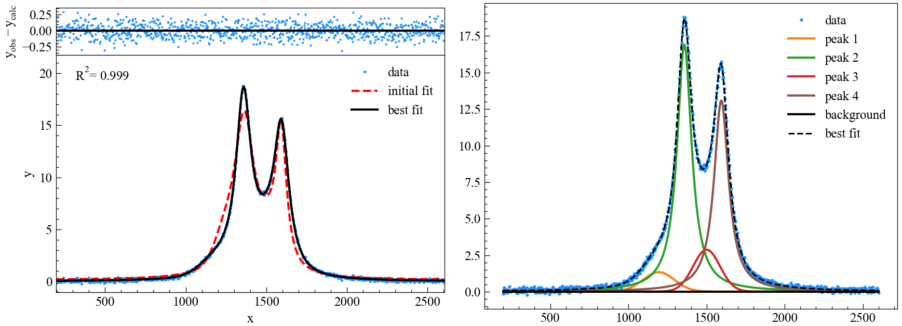
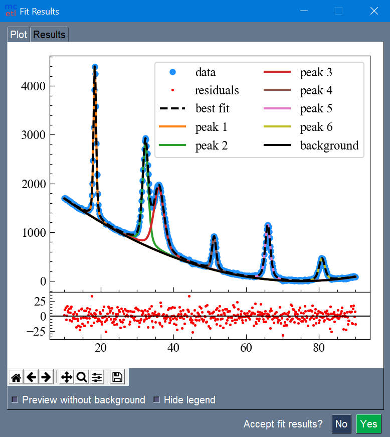
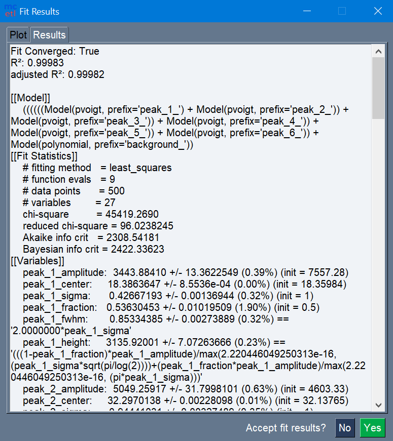
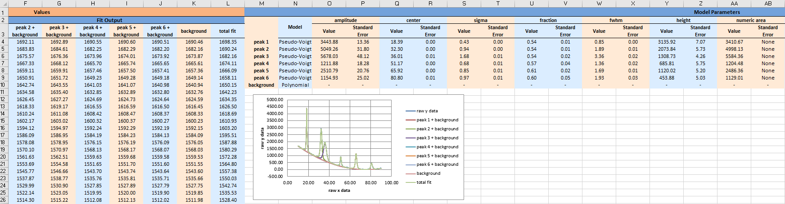
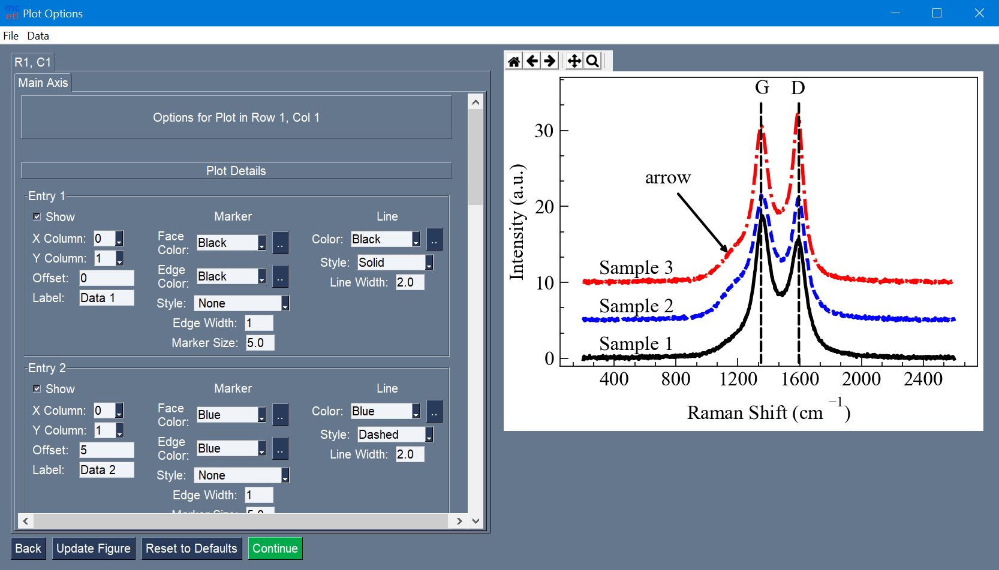

=======
Gallery
=======

   Selection of DataSource and processing steps for main GUI.

   File selection for each sample in each dataset.

.. figure:: images/data_import_1.png
   :align: center
   :width: 280 px
   :height: 396 px

   Options for importing raw data.

   Naming of samples and columns, and setup for Excel plot.

   The output Excel file after processing all the raw data files.

   The fitting GUI.

   Manual selection of peaks within the data.

   Fit results with best fit and individual peaks.

   Fit report for the fitting.

   The output Excel file after fitting.

   The plotting GUI.
