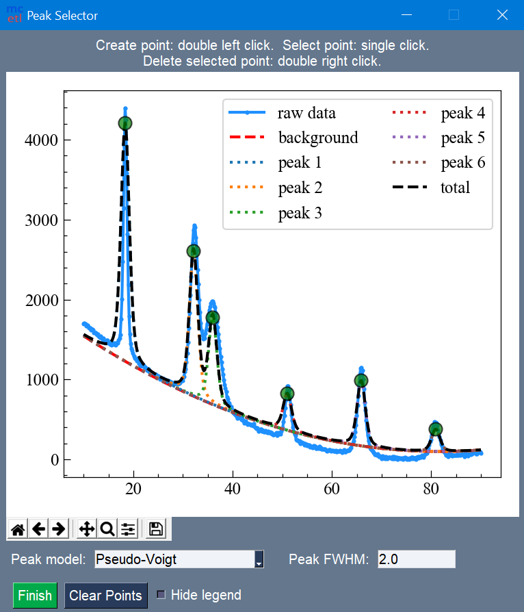

=======
Gallery
=======

.. figure:: images/main_1.png
   :align: center
   :scale: 60 %

   Selection of DataSource and processing steps for main GUI.

.. figure:: images/file_selection.png
   :align: center
   :scale: 60 %

   File selection for each sample in each dataset.

.. figure:: images/data_import.png
   :align: center
   :scale: 60 %

   Options for importing raw data.

   Naming of samples and columns, and setup for Excel plot.

   The output Excel file after processing all the raw data files.

.. figure:: images/fitting_1.png
   :align: center
   :scale: 60 %

   The fitting GUI.

   Manual selection of peaks within the data.

.. figure:: images/fitting_3.png
   :align: center
   :scale: 60 %

   Fit results with best fit and individual peaks.

   Fit report for the fitting.

   The output Excel file after fitting.

   The plotting GUI.
