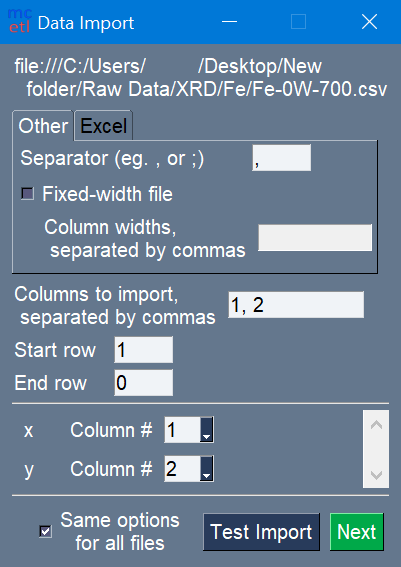
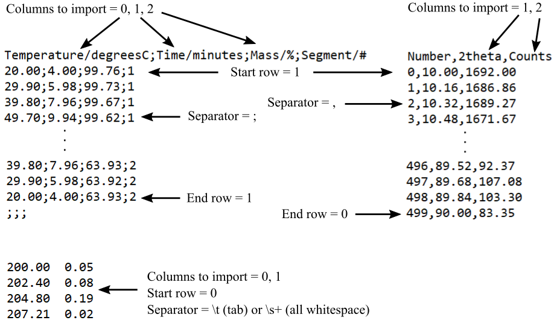
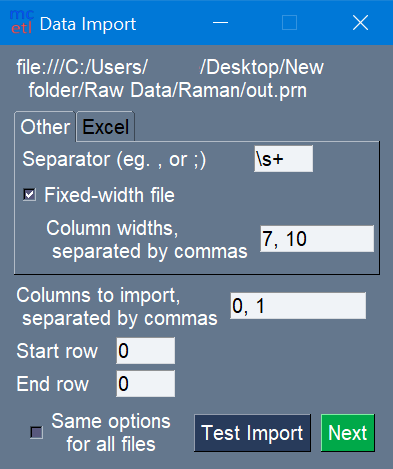
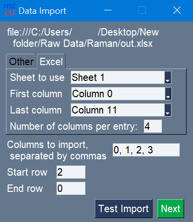

==============
Importing Data
==============

mcetl allows importing data from various sources such as text files, csv
files, fixed-width files, and spreadsheet-like files (xlsx, xls, xlsm, xlsb, ods, etc.).
Note that the default installation of mcetl only supports importing from spreadsheet-like
files with either xlsx or xlsm file extensions
(the file types supported by `openpyxl <https://openpyxl.readthedocs.io/en/stable/>`_).
To import data from other spreadsheet-like files, the appropriate Python library
must be installed. For example, to read xls files, the `xlrd <https://github.com/python-excel/xlrd>`_
library would need to be installed.

Figure 1 below shows the Data Import window. The meanings of the fields are as follows:

* Columns to import: which columns in the raw data file to import
* Start row: the first row to use from the raw data file
* End row: the last row to use from the raw data file

In addition, if using the Main GUI through
:func:`mcetl.launch_main_gui() <mcetl.main_gui.launch_main_gui>` and processing
data, then a section will be added to the bottom of the import window
to select the column numbers for each unique variable ('x' and 'y' in Figure 1)
for the selected DataSource.

   Figure 1: Options for importing raw data. Columns for unique
   variables for a DataSource are also selected.

Figure 2 shows examples of different start rows, end rows, data columns,
and separators to help show the meanings of these terms. In Python, counting
starts at 0, so if you wished to use the first row, for example, you would put
0 as the start row. For the end row, it is counting up from the bottom, so the
bottom-most row is row 0, the row above it is row 1, etc.

   Figure 2: Three raw data files with different import options.

For most file types the only other unique item that needs filled out is the separator.
Common separators for files are commas (``,``), semicolons (``;``), tabs (``\t``),
and whitespace (``\s+``). `Regular expressions <https://docs.python.org/3/howto/regex.html>`_
can also be used for the separator.

For fixed-width files, the widths of each column also need to be specified, as
seen in Figure 3.

   Figure 3: Importing raw data from fixed-width file.

For importing data from existing spreadsheet-like files (xlsx, xls, etc.), there are additional
options to choose (Figure 4). The assumption when importing data from a spreadsheet-like
file is that the data has a common, repeating layout. The options are as follows:

* Sheet to use: which sheet in the file to use
* First Column: the first column in the sheet to use
* Last Column: the last column in the sheet to use
* Number of columns per entry: how many columns are associated with one set of data
  in the selected sheet; the total number data entries that will be extracted from
  the file will be equal to (Last Column + 1 – First Column) / Number of columns per entry.
  For example, if the First Column is column 0, the Last Column is column 11, and there
  are 4 columns per entry, then the total number of sets of data is (11 + 1 – 0) / 4 = 3.

It is recommended to start from the top of the Data Import window, and work
down because various fields are filled out automatically when selecting the
sheet to use, number of columns per dataset, etc.

   Figure 4: Importing raw data from a spreadsheet-like file.

At any time, the “Test Import” button can be pressed to look at how the imported
data will look. When the data source is a spreadsheet-like file and the columns per entry is
less than the total columns, two windows will show up, with the first window
corresponding to the total set of data starting at the first column and ending
at the last column, and the second window showing the individual data entries.
Any errors that would have occurred during data importing will simply give a
pop-up warning window when using “Test Import”, rather than causing any issues,
so it is best to use “Test Import” if you are unsure if the import options are correct.
